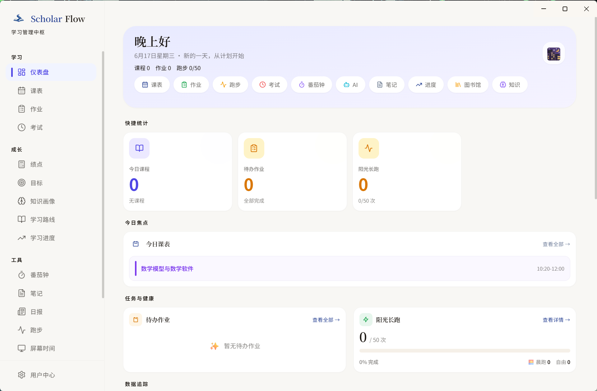

<div align="center">
  
  <h1>ScholarFlow</h1>
  <p><strong>面向大学生的本地优先学习中枢</strong></p>
  <p><strong>A local-first student workspace for campus life and study workflows</strong></p>

  <p>
    <a href="https://github.com/Health-525/scholarflow/releases">下载最新版 Download</a> ·
    <a href="docs/school-adapter-guide.md">学校接入指南 Adapter Guide</a> ·
    <a href="https://github.com/Health-525/scholarflow/issues/new?template=bug_report.md">提交问题 Issues</a> ·
    <a href="https://github.com/Health-525/scholarflow/issues/new?template=feature_request.md">功能建议 Requests</a>
  </p>

  <p>
    <a href="https://github.com/Health-525/scholarflow/actions/workflows/ci.yml"></a>
    <a href="LICENSE"></a>
    <a href="https://nodejs.org"></a>
    <a href="https://github.com/Health-525/scholarflow/releases"></a>
  </p>
</div>

---

## 预览 Preview



**推荐使用方式**

- 普通用户：优先下载 Electron 桌面版
- 开发者：优先运行 Web / Electron 开发环境
- 学校扩展贡献者：通过 `SchoolAdapter` 接入新学校

**Recommended usage**

- End users: use the Electron desktop app first
- Developers: run the Web / Electron dev environment from source
- Contributors: add new schools through `SchoolAdapter`

## 为什么是它 Why ScholarFlow

ScholarFlow 不是单点工具，而是把学生每天会切换的任务统一到一个工作台里。

ScholarFlow is not a single-feature app. It is a unified workspace for the tools students actually switch between every day.

- 课表、考试、成绩来自教务系统
- 座位、预约、消息来自图书馆系统
- 任务、笔记、番茄钟、日报通常散落在不同应用中
- 很多在线工具还要求把数据交给第三方服务器

- Schedules, exams, and grades usually live in academic systems
- Seats, reservations, and notices live in library systems
- Tasks, notes, timers, and reports are often split across different apps
- Many online tools also require sending data to third-party services

ScholarFlow 的核心思路是：本地优先、离线可用、桌面体验完整。

The core idea is simple: local-first, offline-capable, and desktop-native.

## 适合谁 Who It Is For

- 想把校园信息流和个人学习流放到一起的大学生
- 重视隐私、不愿托管教务账号和学习数据的用户
- 想验证校园效率产品方向的开发者
- 想扩展更多学校支持的贡献者

- Students who want campus data and personal productivity in one place
- Privacy-conscious users who do not want to outsource academic data
- Developers exploring student productivity products
- Contributors who want to support more universities

## 核心卖点 Core Strengths

### 本地优先 Local-first

- 学习数据默认存储在本地 SQLite
- Electron 桌面端通过 `safeStorage` 保护敏感凭证
- 记住密码仅用于本地自动刷新

- Study data is stored locally in SQLite
- Sensitive credentials are protected with Electron `safeStorage`
- Remembered passwords are used only for local refresh workflows

### 工作流优先 Workflow-first

- 课表：今日 / 本周 / 查询视图
- 作业：快速录入、状态跟踪、进度管理
- 成绩与考试：同步教务数据并集中展示
- 图书馆：预约状态、消息、JWT 刷新
- 笔记：Markdown、搜索、自动保存
- 日报与周报：把学习记录沉淀为可回顾内容

- Schedule: today, week, and query views
- Assignments: quick capture, status tracking, and progress management
- Grades and exams: synced academic data in one place
- Library: reservation status, messages, and JWT refresh workflow
- Notes: Markdown, search, and autosave
- Reports: daily and weekly review output

### 桌面增强 Desktop-native

- 本地安全存储
- 自动更新
- 后台自动刷新调度
- 活动窗口追踪与使用时间统计
- 图书馆登录窗口与凭证刷新流程

- Local secure storage
- Auto-update support
- Background auto-refresh scheduling
- Active window tracking and screen-time insights
- Dedicated library login and credential refresh flows

### 可扩展架构 Extensible Architecture

- 当前内置 `njtech` 与 `mock`
- 新学校接入不需要重写核心业务层
- 适合逐步扩展为多学校支持

- Built-in adapters currently include `njtech` and `mock`
- New schools can be added without rewriting the core product
- Designed to scale toward multi-school support

## 功能总览 Features

| 模块 | 中文说明 | English |
| --- | --- | --- |
| 仪表盘 | 汇总课表、作业、跑步、考试倒计时、教务通知、最近日报 | Dashboard with schedules, assignments, running, countdowns, notices, and recent reports |
| 课表 | 今日视图、本周网格、日期查询、学期周次计算 | Today view, weekly grid, date query, semester week calculation |
| 作业 | 快速新增、列表管理、完成状态追踪 | Quick add, list management, completion tracking |
| 考试 | 考试安排查看与管理 | Exam schedule viewing and management |
| 成绩 / GPA | 教务同步、绩点展示、按学期查看 | Grade sync, GPA display, semester-based views |
| 图书馆 | 阅览室状态、预约、暂离、取消预约、馆内消息 | Reading room status, reservations, leave/cancel actions, in-library messages |
| 笔记 | Markdown、搜索、自动保存 | Markdown notes, search, autosave |
| 番茄钟 | 专注 / 休息循环计时 | Focus / break timer |
| 目标 / 跑步 | 习惯与目标追踪 | Goal and habit tracking |
| 日报 / 周报 | 学习数据沉淀与趋势复盘 | Daily and weekly reporting |
| 设置 | 主题、数据导出、刷新策略、账户与设备信息 | Themes, export, refresh strategy, account and device info |

## 平台支持 Platform Support

| 能力 | Electron Desktop | Web / PWA | Android / Capacitor |
| --- | --- | --- | --- |
| 课表 / 成绩 / 考试同步 | 支持 | 支持 | 实验性 |
| 作业 / 目标 / 番茄钟 / 笔记 | 支持 | 支持 | 实验性 |
| 图书馆预约与 JWT 刷新 | 支持更完整 | 受浏览器限制 | 实验性 |
| 本地安全加密存储 | 支持 | 不完整 | 不完整 |
| 活动窗口统计 | 支持 | 不支持 | 不支持 |
| 后台自动刷新 | 支持 | 不支持 | 不支持 |

桌面版是主形态，Web / PWA 是补充形态。  
Desktop is the primary experience; Web / PWA is secondary.

## 技术方案 Tech Stack

- `Next.js 15` + `React 19` + `TypeScript`
- `Tailwind CSS` + `shadcn/ui` + `Base UI`
- `Zustand` + `TanStack Query`
- `Electron` + `better-sqlite3`
- `Capacitor` Android
- `Vitest` + `Playwright`

## 快速开始 Quick Start

### 用户 For Users

前往 [Releases](https://github.com/Health-525/scholarflow/releases) 下载 Windows 安装版或便携版。  
Download the Windows installer or portable build from [Releases](https://github.com/Health-525/scholarflow/releases).

### 开发者 For Developers

要求 Requirements:

- Node.js 20+
- npm 10+

```bash
git clone https://github.com/Health-525/scholarflow.git
cd scholarflow
npm install
```

启动 Web 开发环境:

```bash
npm run dev
```

启动 Electron 开发环境:

```bash
npm run abi:node
npm run electron:dev
```

验证命令 Validation:

```bash
npm run typecheck
npm run lint
npm test
npm run check
```

### 构建 Build

```bash
npm run electron:build
```

或分别生成:

```bash
npm run electron:build:portable
npm run electron:build:installer
```

## 当前学校支持 Current School Support

- `njtech` - 南京工业大学 / Nanjing Tech University
- `mock` - 本地开发与适配器调试 / Local development and adapter testing

如果你想接入新的学校系统，请阅读 [docs/school-adapter-guide.md](docs/school-adapter-guide.md)。  
If you want to add a new school integration, read [docs/school-adapter-guide.md](docs/school-adapter-guide.md).

## 项目结构 Project Structure

```text
scholarflow/
├─ app/                # Next.js App Router pages and API routes
├─ components/         # Shared UI components
├─ electron/           # Electron main process and desktop features
├─ hooks/              # Query and business hooks
├─ lib/                # Core logic, SchoolAdapter, SQLite layer
├─ store/              # Zustand stores
├─ tests/              # Vitest tests
├─ e2e/                # Playwright tests
├─ docs/               # Architecture and integration docs
└─ screenshots/        # Screenshot assets
```

## 安全说明 Security

- 敏感凭证优先使用桌面端系统级加密存储
- Electron 使用 `contextIsolation: true` 与 `nodeIntegration: false`
- 内部 API 调用带内部 token 校验
- 图书馆登录与证书信任逻辑有显式边界控制

- Sensitive credentials use desktop-level secure storage where available
- Electron uses `contextIsolation: true` and `nodeIntegration: false`
- Internal API calls are protected by an internal token layer
- Library login and certificate trust logic are explicitly scoped

更多说明见 [SECURITY.md](SECURITY.md)。  
See [SECURITY.md](SECURITY.md) for full details.

## 贡献 Contributing

欢迎 Issue 和 PR。  
Issues and pull requests are welcome.

- [CONTRIBUTING.md](CONTRIBUTING.md)
- [docs/school-adapter-guide.md](docs/school-adapter-guide.md)
- [docs/DATA_MODEL.md](docs/DATA_MODEL.md)
- [SECURITY.md](SECURITY.md)

## License

MIT © 2026 [Health-525](https://github.com/Health-525)
